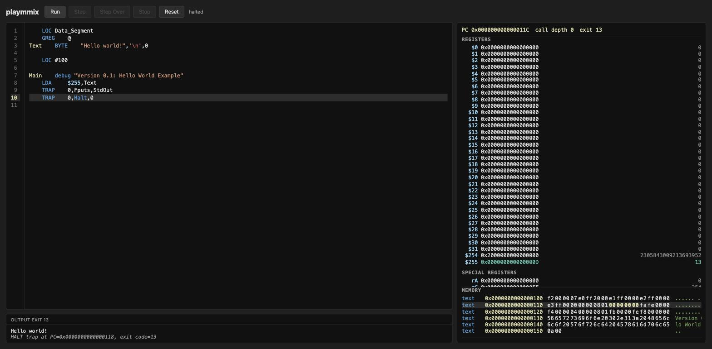

# playmmix

A browser playground for [checksmix](https://github.com/jac18281828/checksmix),
an MMIX interpreter that runs in a browser tab.

[](https://playmmix.2ad.com)

**[Try it: playmmix.2ad.com](https://playmmix.2ad.com)**

## What it is

playmmix pairs an MMIX source editor with a live debugger, entirely in the
browser: no install, no server round-trip. Edit `.mms` assembly on the left;
registers, memory and program output update on the right as you run or step
through it. Every edit re-assembles and reloads from the program's entry
point — nothing runs until you ask it to.

## How it works

The page loads with a minimal skeleton: an entry point that halts cleanly,
and an empty data segment ready to build on.

```asm
        LOC     #100
Main    TRAP    0,Halt,0

        LOC     Data_Segment
        GREG    @
```

Paste in something that does more. This prints a string and halts:

```asm
        LOC     Data_Segment
        GREG    @
Text    BYTE    "Hello world!",10,0

        LOC     #100
Main    LDA     $255,Text
        TRAP    0,Fputs,StdOut
        TRAP    0,Halt,0
```

`LDA $255,Text` loads the string's address into a register. `TRAP
0,Fputs,StdOut` prints it. `TRAP 0,Halt,0` stops the machine. Click **Step**
and watch `$255` pick up that address the instant the `LDA` runs.

Controls, top left, each key cued by its button's own bold amber first
letter; on a phone or tablet the bar sits fixed at the bottom of the screen
instead:

- **Run** (`r`) — restart from the start state and run to a breakpoint or
  halt.
- **Continue** (`c`) — resume a paused run in place: execute the instruction
  at the PC, then run to a breakpoint or halt.
- **Step** (`s`, `F11`) — execute one source-level step, following into
  calls.
- **Next** (`n`, `F10`) — execute one source line, running any call along
  the way to completion rather than stepping into it.
- **Interrupt** (`i`) — pause a Run, Continue, or Next in progress.
- **Reset** — reload the current source from the top, clearing output and
  highlights; breakpoints are kept.

Run always restarts from the top, even mid-program, so it never quietly does
nothing; Continue instead picks up exactly where a paused run left off.
Reset also returns to the top, but waits there instead of running.

Press **Ctrl-S** (**Cmd-S** on macOS) anywhere on the page to reassemble
immediately instead of waiting for the debounce.

Click a line number to set a breakpoint. Registers, special registers and
memory update after every step or run, with whatever changed highlighted.

## Learn MMIX

- [Knuth's MMIX page](https://www-cs-faculty.stanford.edu/~knuth/mmix.html) —
  the introduction, the Fascicle 1 tutorial and the instruction set.
- [mmix.cs.hm.edu](https://mmix.cs.hm.edu/) — full documentation, a visual
  debugger and example programs.

## Developing

### Run it

Install [Trunk](https://trunkrs.dev/) and the wasm target:

```sh
rustup target add wasm32-unknown-unknown
cargo install trunk --locked
```

Then, from this directory:

```sh
trunk serve
```

Open `http://127.0.0.1:8080`.

### Debug it

`cargo test` runs the Rust-side unit tests — editor, control, machine-pane
logic — on the host target, no browser required. `docs/layout-spec.md` is
the normative spec for machine-pane layout decisions.

### Deploy it

playmmix deploys to [playmmix.2ad.com](https://playmmix.2ad.com) via CDK;
see [`cdk/README.md`](cdk/README.md).

### Contribute

See [`AGENTS.md`](AGENTS.md) for this project's coding and review
conventions.

## Relationship to checksmix

playmmix uses [checksmix](https://github.com/jac18281828/checksmix) as its
MMIX assembler and interpreter — instruction decoding, the register file
and TRAP handling all live there. playmmix calls only its public API
(`MMixAssembler`, `MMix`) and builds the editor, the run/step controls and
the machine-pane rendering around it.

playmmix requires checksmix 0.3.13 or later and reads MMIXAL exactly as that
release does; see checksmix's own `CHANGELOG.md` for the language rules.

Want MMIX outside a browser — a real debugger, `.mmo` object files,
gdb-style stepping from a shell? [Get checksmix
here](https://github.com/jac18281828/checksmix).
