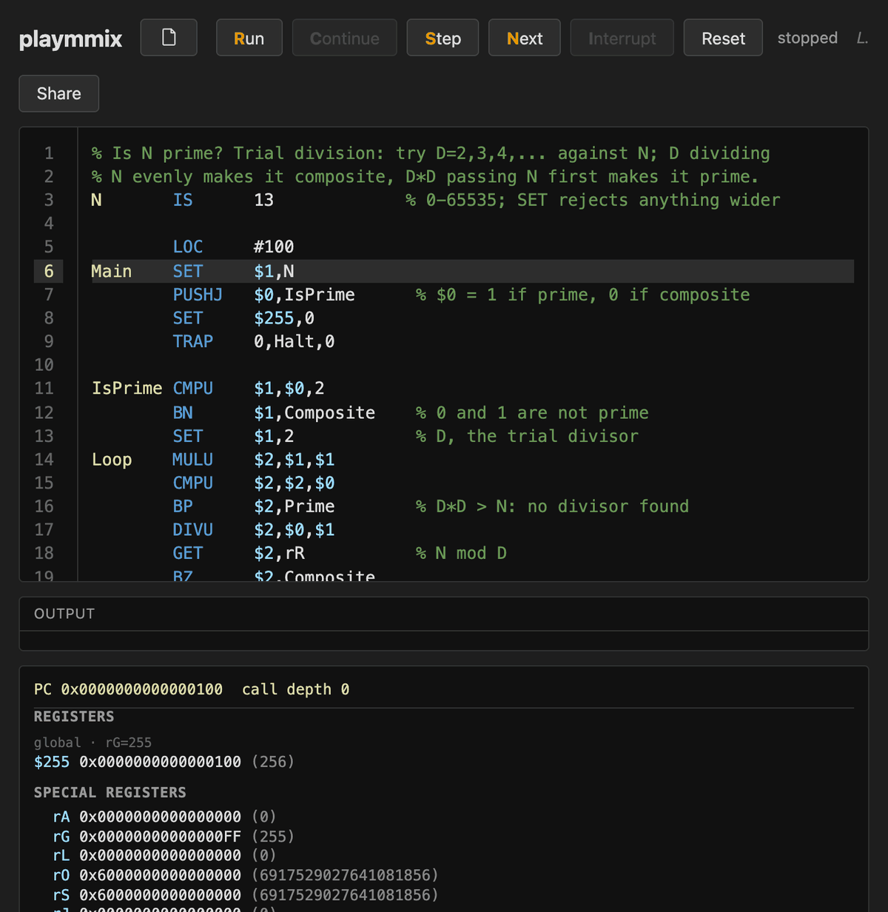
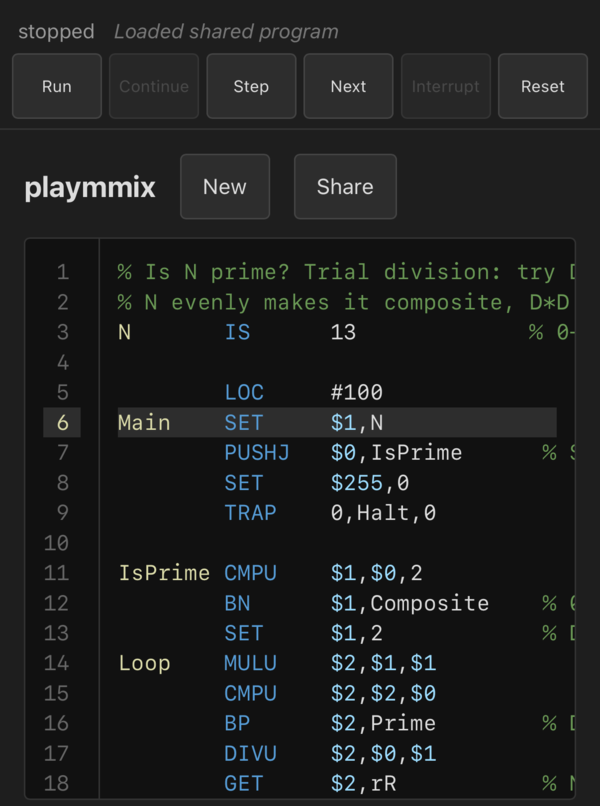
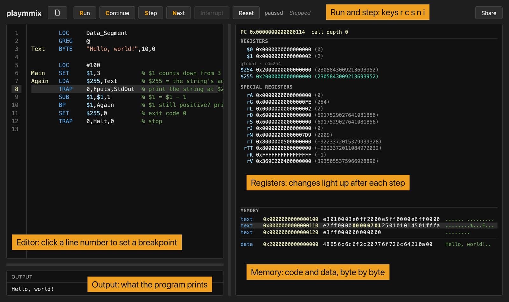

# playmmix

<a href="https://playmmix.2ad.com"></a>

Write, run and single-step Knuth's MMIX assembly in your browser, on a
desktop or a phone, with nothing to install.

**[Try it: playmmix.2ad.com](https://playmmix.2ad.com)**

## On your phone

playmmix, a full assembler and debugger, works on your phone.

<a href="https://playmmix.2ad.com"></a>

## Examples to try

Click a program's link to open it in playmmix, loaded and ready to run.
Hello is short enough to paste in by hand.

### Say hello

Prints a greeting. Change `world` on the `Name` line and run it again.

```asm
% Say hello. Change the name on the next line, then run it.
        LOC     Data_Segment
        GREG    @
Hello   BYTE    "Hello, ",0
Name    BYTE    "world",0
Bang    BYTE    "!",10,0

        LOC     #100
Main    LDA     $255,Hello
        TRAP    0,Fputs,StdOut
        LDA     $255,Name
        TRAP    0,Fputs,StdOut
        LDA     $255,Bang
        TRAP    0,Fputs,StdOut
        SET     $255,0
        TRAP    0,Halt,0
```

**[Open in playmmix](https://playmmix.2ad.com/#p=nY7NDoIwEITvPMWKemtMNeEuf8JBxQAXT6YJDZCUYrBEfXvZakCiB2Mvu51vJzNzSNgdCi5EvQC3YDLnoAoOklUcavnc-U2BKCUn-JXQtBJKtTDg9baRq6fHFDslPK-4VD0MYj_AuTZCDOk255j6qJhaIGASauwx7p1d60ZkSJyu0ohMTLKkHfiIny4pNXaslFr0bC3OVpZFdFB_n8b2ASclm3OrLiRRWdQOhUdO7PWXEWv_akz8dDDSL66QCdWBBw)**

```
Hello, world!
```

### On what day will my birthday fall?

Prints the weekday your birthday lands on, year after year. Open it, set
`MONTH`, `DAY`, `FROM` and `YEARS` at the top, and run. The default, 29
February from 2000, prints only the leap years.

**[Open in playmmix](https://playmmix.2ad.com/#p=nVjbUttIEH3XV3RloWIqA9HF5pKqrSzE3FKAKQyh2JetwRpjLZLGJY1i_JZ_2D_cL9nuGV0tGWpxSjaa093q6cuZVjZhFMNixhX4fAmLIAwhWsJjkKgZLUx5GH6FbzMePwm4HF3dnjEYHj4wOLkZXQKPfXg4PrwZ71gaA4DzMeiPC83PJjj__vrHcS3U1gul4EGXoOdY-gl1Qdu2VwQH-x7KHuCHgZoJmAZJqmApeGJptxranf7YNoOZXEDE46VWTEFJmCdBrCyrkL0YfdO_Q674X2PxFAlEC_D05viUfv-wLmWsZkO-THPk6OH2GDyHufsMvz279t24tcb8mUdSydu6IiLMZQNGvwPmsD7bxfu-NRbzSgg_H-ADs62rC2isOjYuPuB-hsFToNKG3fKfNc5iSnJlyyyQQdxMEzILBN1mIiWshPIFwu6FHxu09sgP5apWn2VJTSIXKVZJ4iQJms82CwSNucqSlnKxShKtrP2GSbY24UJyXxfJPORBDL1Yxtuh4PMtXfgTmcUKpjIxRQ7TREbAwXG3MdfJEhR_DAVWOamS7eGhtr3h2qxMe_Xk4dGdRh1GAj1tctvZstCN8_REPEJvw92CIAUHW0_E-TPxHrEk48mSgQhTAfZOaXN8bKpjY49p6RL4dnltgH2GmNtWcDEoZbiu_iyEnZMuUcdyzshNKp1D_-8M26m34XX6-p3H5CpgzAq3v0BRyh9TNBIJNZMY9ERwLEH8G7ekFhIiilgKPNX5UDwIQU7139c3xz_OR3dj3Yo7a_botR33Gnu8KoTdky5Rx3L1HitfYS6Sbe0VOjJNRa0SWFEKqZhgB7Qqosp5UREOK_u5XRF9RgK1imj5N2BEfO31Xb3-SfNaR-Y81q_R4yZSMwRRJPyAKwES90dcPZOhn4KMwyXY2-5gYGmKuJBy3hnqAdvY7QorKQxlLEw9o8vQo-RNsiTB2OjcbWHEqLv0zVc4TcSTTAJ0KslC8QX84GeQBhhAeFyikT7W-8tEzBVqTdBElhgyhl5dEEnN3oIsDkWKxROmsjKDNhDHCFQJGZ7_MCE_oI30K74uQoYUmdy0OwOXr6S6QN_XmCI6-R_GztNXbGHe3uOYsVlLv-NgVRca3_MUkoxOU67WELetEsbgDaVI6VzHNATY8kHR5mqGjW5SOKKqKRodW8YwZiR_ipRZm3oU0IUl43rqOwjMcdlG5eyR2R1xz_g5mJNThnfaEuj1GpHD4fCusk0stkawcsJjuN121TvYoIihker511BiZJZaZoU-eEjVrWbRF1gI8UwHyu_QW8InWH7uwzZ-Y9GYO_2r8EKhLeJIJMg9Bkvg2lPha-pBbv2MsWalORsNmsO5K6JYSIN2vDysl4rHK7W74nRCNbwcq1OsLFRnV4v1O5A9Y6DWEBW2r7F6gVdZOjCYs9vhFGF07a3Ro2t_PdZ_M9dtc15ndyK0125O16XmxMRd04yoDy3NVHiY-WISRDwEJV6UoTg_py1IxBzPQOGHeLJPccYO4ic0QcqP2XQqEnPI0KAmsI8e-eR5wRO_I9U4MNZSXR46OEpWw157pwjT1be8s5V9etgwaNPpoDTPq9NQZQu7A6-P9sfKu9ujGubUzuIyrbkHTveOPLdNdzQaH63dSochPM8IKoHbm0PduTY7mWcqZWPljzLVcWCjHg7Vb-lhvjD5NPhQ2oq-DGJfvDBsT-rafJzO5vQOsWuW8sl0B-55-Iw2AnzRkouY6gK5FwSfzEAFkSAgCtIU2RSPOIUjES7EPEJeprLIn7fTwZsu06VoHt6OPOJ0Oes1zWT_Hs188H-PavlK8K7n5i8L79E17xKtw9LEMM-W1RXRZsE0sYaVe5MrfbZ2BbhhaAV73dBqvBuWVsHXTbXj3zDWht_wbDUjTddW0deNraSoYeq19LUMlfnszmEj23Xl91DI1cWbDFJODy1WG-jBsrWrcjq3ypG7k_bs-v9r4AiN41dMo5zCKc0XDGJJk3WqEq5Zp8PRMx4q5O3_AA)**

```
2000 Tuesday
2004 Sunday
2008 Friday
2012 Wednesday
2016 Monday
```

### Digits of pi

A showpiece: an MMIX program that computes `DIGITS` decimal places of pi
with Machin's formula, doing arbitrary-precision arithmetic on arrays held
in memory, each array standing in for one number too wide for any
register. `DIGITS` runs 1–1000. At 334 lines the source lives behind the
link.

**[Open in playmmix](https://playmmix.2ad.com/#p=7VpZc-JIEn7Xr8iYxeFLpiUM-JjwxmDT3eMJHx0Gr2P6oTdkVIDCoGJ1-Nhfv19WSULowHasd2cehqBboo6sysyv8ipvUN-beFFIckwLr0lnU8efCOqffz0fDuhezOSTSTZFkmzLsprGhrFBl85o6vmbIY1lMI9njomZdEJ2d8cJRpHjb9mfOtu0R-3l79b-0bZJURz4IQaDhueDZPQkKRSBJ0JyaCTnizgSAY0cn8J4TuLZGUWzlyZ9xnrkx_N7dKodkReCRCQlPXmu4G2Q9AUFYuKFoGBSKMmLaOY9grLn01zMZfCCN_Q67jFhAScInBcQAdt39CQDNzTp3gmFYlN_aMv3QNUVI2_uzMjVclpgEzwe7MxlGIFE6E18b-xh25HqobEXhFETgn0cYOLMpMt4lrz1XPecOXd8lwbxPb-DgmbKCQTNpD_BSo9e6EkfK8SzyFvMQDtSvx3X9fhNzQ_j-yiAiPCbGfEpmjqRZsxU8lCb4SaKvLmgvT2MEBQ6eHcCL5rOReSNKHLiyTQiRWThLFh8IxDxhEsyTji6f9HPRIIsNSUO7lAvTSNBDJ3jH38gR-Prbe-mT7m2jjG8HvYu-ssmPW3X3lVjjTvdmnVv6fG7h9ufjoyL3mB4_eVL1nm4s3W3Z28bRjKJLq7PNFEncv45EJO58KOs8-vN56_8_MU4hZ7PJFhJeq7Phr2c3o1v8sm20nbNiv6YduEleepHtlJ-Hnfhn2kzVRH0gqC02192D3fujKEI5vW9g3j-TYZr-6_EpL7_RoSAUqd-QF-MTuNxRWeioJZxwYrH5_T34Wd-_rTf_Mm0ysL_G2v-0sGxw-e3y2-qkX8PIieIDKBsDx_6LgLZY6xuAdTBScPaPoYtiNLTyLhtWGx3_o2BTSMbnq03-DxUz0bLtMqN--ad8f1CN55-p7SRyfRxNsoT2nkqw-u0sWGZjVbW0ev3b5M18T1cTrg9vU1WwNfO2lP2v18YpZW_Xes-i4WYCOVMLl60UFwRRhAKTFkwOmnYEA630PEJN5iplJpGNqNKBFY1m2eJXM6S3TW6ppJXOvj06iptZ_Iru77oJ6LpmA3bbLTLMusombXLMoMw2zmZZe01Mju7MEqrV8nsPGTR5lAUCO1nbPLGBKu7hBQMLKPJJDGDpYc303Nfl9mdcZ6AKcNS29STfxdhpXAgg_2cRL-nHXrWlayRQwWmlNzK8sGOjPIWsk1bVVPU8BsRGaVd5OZZxnJcUfB2TvCpf0tFb2rHJQONV26lTydpY4ZZE_PZc-5V-00T-pvDWrgqEtB-SAcL8F2-eNZj4W-S1XPC72kODszMwJc1c2Dia73ZiFQ0doGG_qCAhq6J_dQelBUsXN5e0NKGNA5qjEujk3X0z_9xm5JCx1KvX5e7D27qTuL-25EGO9CtgA24NRL2Kk9gGt4sgZDGLSKPhZ2TXPsKHGbCWYMHRsELLQK5cCZOBDhE8slBNwNiHEgfwUe6g_8tGO6qTEMSlBiXRUjsm9jVOki0y5CAAjp5BWcaU5rJOaIMEi3VcVCGRGcNJNo1RubtDg3cGgl7lZBI4tw6N7a76sbMBAH1wbSRBs6ZYo_WKfbIxPeDFNs7LykWm3mbYrOObsFbZoo9UBrvVnYc5DWeOetD1XG0nrnTK0pHY7NX8ozPUFm7B_W0bKNq4nB5cj4ERxCukUizEkdJjlSHoz2FI1Ld9Hf9wwmRPArkZ6BRwFcduJJV_gBwDcrgwmY-ClxFq5HH0ArqajB0lY7Gnq7kqQwC-VRepaOI1YCoamYGik5xGx9tpiBeI5FnDbzmlNUonrdpBznbj62jHU4rTXpGiSP8V8xhI7IZyFgHIstcDIGM58chZdkXMvQZChA-0nXk8Qw3IDaSiwX_lP5I6Ax8Gnj-AzctOCcEmZjDnTGKAOEy41mmTCWndmSW88Fvt4Nff9PaKudKqzMLmeJbZ5YS2HdMtK1Xz1E2AdlyaakMGZhkW1WzKvaXAREzOlW7zmLIyvCZcp8NTkZPqPWwCxSwDqHlOeAhXReWyJfAgRPJqqVNq0DHBh2LIyLKsMQVtmUD1GMMVFWscyHlAvBQnNHUCRk6sf_AA30ZoQg3OSbxKBAezRwunfGuYNnimavoMZCQSHOtbOqhdBWglKULS6GOp5PiG_pcHJHme7Wu84RylgODofevDNkGDXl1tTc8NTOcFbhCVZa2WKrbP-smPhVcC1y80IMQi2Q4FwyjUMzGfAJR8lIlvywh8EBaFcgqGSgVVtbhLMdcObNeQzQPtYa1Fmu5-mla-0xsBl7ZZBxrLGQyg7Kfpt5oyoomqB9VyYkqf0aoSrLqYi2HZlkRdqoIxtSbzEheOkUmc9wk4VjZ4OrlemPsHGOMV5cvVq3et3xxuQ0aKNuagAzg6vxoqWLpXD4KymeRhZOrK6pssEEkQKnrZRVjrInmu61Oa73ZKblSBo_ZqvakJZ9nF7LBgg4S26FVvOKoGDS5Sv3P6qRxwdwJuZwOX5crF3J1GpLg6noc8umESMKsiozjEWaCUmX-FNSqpt008obg3QBc66vS8nkF1apq5yrZeue5PPZ_-d0P8LtAxHrPu0HFS6L0jiK1jvje8-l9wpUFPZ9g1DHhvx-tk86B3bKb62tfeU-coBGT1eH4YG8HsnUw_7P5oFpHAR7-v64CCxacxdotfIS7yC_57jCSEfeH2fQUuK_i7QPMKt8GvuVWF7c2I2cmSPAlre5RZ5ivE3Gle89XqCpgxl2vSp-Wxrn5RtudV4Ddrdp0ff2vShZ5eu33kvtvfEtOtir9_PysLnDT2_bCTbMzViE9ZLeQkBzXOuernnmLO1HaUFHz5v4mO3bVpCLimfbB2yq0WQRMAp3z5iqNqZy5fCePcDRZV9168x21qpGoXEFf9iJ1CXkAAgRVPWnYn450erGQob6XxpC5dOlIGWuMwyzwqS9UF97oIdSX1JyPa5q4Ym5W2Wq76sBoOZXlvm8m15fqbxlWbHtWWMFsxd7KkcnKqG0uoRxRLk1rA_vJnbcrnnErcYOGjE_F2mtF14ybrnlIK0mguiHG5bR2cAiuDhGrcvzvLPIJf74uzDvsVtW3KwF5nbomrtR1c2wdggulAuZtM1G2Vnx5WVsXaKrWrY0u2PlwsNDJlrQ5c-a6yiGsRyrB7bIObBi_Qw4zKiQIY2lVzEDZh2fZrbIq7DZ0kZe5UqAKLnBaZin-nlALFG7Zatss77a5aW3mYqHTZV_-aqjuJnNJzFxFdGrt1UVPxX1LhuIKyA5yDOZFVdxcWWWtTsfkS_ysZ3jTUwta5pdFHIXmIHKv46h6YuHvA16ZujyzmGpVzPoVOS86_gM)**

```
3.1415926535897932384626433832795028841971693993751058209749445923078164062862089986280348253421170679
```

## Write your own

An MMIX program has two parts, data then code, and hello has both:

- `LOC Data_Segment` starts the data, and `GREG @` follows it so the code
  can reach the labels there. A string is a `BYTE` list ending in 0:
  `Text BYTE "Hi",10,0` holds "Hi", a newline and the terminating zero.
- `LOC #100` starts the code. Execution begins at the label `Main`.

Work happens in 256 registers, `$0`–`$255`, each 64 bits wide. Most
instructions take the form `OP X,Y,Z`: compute from `Y` and `Z`, and put the
result in `X`. `ADD $1,$2,$3` sets `$1` to `$2 + $3`. A `Z` of 0–255 can be a
plain number, so `SUB $1,$1,1` subtracts one, and `SET $1,3` loads a number
outright.

The machine reaches the outside world through `TRAP`. Load a string's
address into `$255` with `LDA`, and `TRAP 0,Fputs,StdOut` prints it.
`TRAP 0,Halt,0` stops the machine, and whatever `$255` then holds becomes the
exit code.

Branches make decisions. `BP`, `BZ` and `BN` jump to a label when a register
is positive, zero or negative, and a loop is a branch backward. This program
prints its line three times:

```asm
        LOC     Data_Segment
        GREG    @
Text    BYTE    "Hello, world!",10,0

        LOC     #100
Main    SET     $1,3            % $1 counts down from 3
Again   LDA     $255,Text       % $255 = the string's address
        TRAP    0,Fputs,StdOut  % print the string at $255
        SUB     $1,$1,1         % $1 = $1 - 1
        BP      $1,Again        % $1 still positive? print again
        SET     $255,0          % exit code 0
        TRAP    0,Halt,0        % stop
```

**[Open in playmmix](https://playmmix.2ad.com/#p=bVDBbsIwDL3nKzw2xCWT0iGOiLWjgwMTiHaHnaZoybpIoakad_D5S1rSFmlWlJc479kvBuhit39pcc2Rf2ayOMkSyfUNNsd04_GZ5PKC_pR85KnHyVZqbSicTa3F3YRGjDLS60LR-4gx8sZV6S9ZmrfJh4jOYRRTl4Ev05RoQZhzCd-1OcGcxEUn3K3jTve0WNDgo9O5DCwBfyRYrFVZzCxwIWppbW8lP8YHj4y-Vg1amqHYN-jVlVPgSAwc24q9NHtPgmG3olvDS789QtSzkwMEdnA-sC0qraEyVqH6latrb-55Q7swH_9PNp6PvCh0ExIS2D__2nKNA3_qepmK_AE)**

```
Hello, world!
Hello, world!
Hello, world!
```

Click **Step** and watch `$1` count down in the registers pane. The
[instruction reference](https://mmix.cs.hm.edu/doc/instructions-en.html)
lists every instruction.

## Find your way around



## The controls

Run, Continue, Step, Next, Interrupt and Reset sit top left on desktop; each
button's bold amber first letter is its keyboard shortcut. On a phone they
move to a bar pinned to the top of the screen, and on a full-screen iPad to
the bottom.

- **New**: start over from the minimal skeleton, asking first when there is
  work to lose.
- **Run** (`r`): start over from the top, wherever the program is paused,
  and run to a breakpoint or halt.
- **Continue** (`c`): resume a paused run in place, executing the
  instruction at the PC, then running to a breakpoint or halt.
- **Step** (`s`, `F11`): execute one line. On a `PUSHJ` it follows the call
  into the subroutine and stops at the subroutine's first line.
- **Next** (`n`, `F10`): execute one line. On a `PUSHJ` it runs the whole
  subroutine and stops at the line after the call, once `POP` returns,
  unless a breakpoint inside stops it first.
- **Interrupt** (`i`): pause a Run, Continue or Next in progress.
- **Reset**: reload the current source from the top, clearing output and
  highlights and keeping breakpoints.
- **Share**: send your program to a friend as a link.

Press **Ctrl-S** (**Cmd-S** on macOS) anywhere on the page to reassemble
immediately instead of waiting for the debounce.

## Good to know

- **Save your work with Share.** playmmix keeps your program in this browser
  as you type, but browsers clear site storage (iOS Safari after a few days
  unused). Click **Share** to send your program to a friend, or to yourself;
  opening the link brings it back.
- **New** and opening a shared link both ask first when there is different
  work to lose.
- A program can print, but playmmix has no keyboard input.

## Learn MMIX

- [Knuth's MMIX page](https://www-cs-faculty.stanford.edu/~knuth/mmix.html):
  the introduction, the Fascicle 1 tutorial and the instruction set.
- [mmix.cs.hm.edu](https://mmix.cs.hm.edu/): full documentation, a visual
  debugger and example programs.

## Build and run locally

### Run it

Install [Trunk](https://trunkrs.dev/) and the wasm target:

```sh
rustup target add wasm32-unknown-unknown
cargo install trunk --locked
```

Then, from this directory:

```sh
trunk serve
```

Open `http://127.0.0.1:8080`.

### Debug it

`cargo test` runs the Rust-side unit tests (editor, control and machine-pane
logic) on the host target, with no browser. `docs/layout-spec.md` is the
normative spec for machine-pane layout decisions.

### Deploy it

playmmix deploys to [playmmix.2ad.com](https://playmmix.2ad.com) via CDK;
see [`cdk/README.md`](cdk/README.md).

### Contribute

See [`AGENTS.md`](AGENTS.md) for this project's coding and review
conventions.

## Relationship to checksmix

playmmix uses [checksmix](https://github.com/jac18281828/checksmix) as its
MMIX assembler and interpreter: instruction decoding, the register file and
TRAP handling all live there. playmmix calls only its public API
(`MMixAssembler`, `MMix`) and builds the editor, the run/step controls and
the machine-pane rendering around it.

playmmix requires checksmix 0.3.13 or later and reads MMIXAL exactly as that
release does; see checksmix's own `CHANGELOG.md` for the language rules.

For a command-line debugger and `.mmo` object files, use
[checksmix](https://github.com/jac18281828/checksmix).
